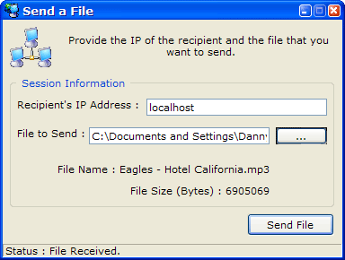



## Send File

### Description

This utility provides a quick and easy way to send files of any type or size across a LAN or internet. I've tested this out with other people over the internet, and have sent files over 600 MB without any data loss or corruption. I also added a little feature in that gives this application the XP-Theme style using an XML manifest file. (which I learned from www.VBAccelerator.com). Please leave comments...:)
 
### More Info
 

             |
---                |---
**Submitted On**   |2003-04-26 07:01:38
**By**             |[Daniel W\. Elkins](https://github.com/Planet-Source-Code/PSCIndex/blob/master/ByAuthor/daniel-w-elkins.md)
**Level**          |Intermediate
**User Rating**    |4.9 (39 globes from 8 users)
**Compatibility**  |VB 5\.0, VB 6\.0
**Category**       |[Complete Applications](https://github.com/Planet-Source-Code/PSCIndex/blob/master/ByCategory/complete-applications__1-27.md)
**World**          |[Visual Basic](https://github.com/Planet-Source-Code/PSCIndex/blob/master/ByWorld/visual-basic.md)
**Archive File**   |[Send\_File1579744262003\.zip](https://github.com/Planet-Source-Code/daniel-w-elkins-send-file__1-45053/archive/master.zip)

